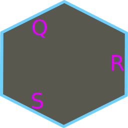
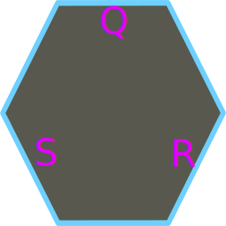

## Hex Grid 4 Demo

A demo project for exploring the capabilities of the [HexCell](Scripts/HexCell.gd) script.
This demo was written for Godot 4 (Beta 4 as of the last commit)

### Getting Started
While the Demo is a fully contained, runnable project, it's core function is to demonstrait what
is possible with the [HexCell](Scripts/HexCell.gd) script itself.

*HexCell* is a self contained class for the manipulation of coordinates within a 2D
Hexigonal grid-space and if heavily based off information on [hexigonal grids by Red Blob Games](https://www.redblobgames.com/grids/hexagons/)

Where a Vector3 is composed of the coordinates (X,Y,Z), a Hexigonal coordinate used in
HexCell is composed of the coordinates (Q, R, S) with a very special rule that Q+R+S = 0
Internally HexCell stores its QRS coordinates in a Vector3i where Q=X, R=Z, S=Y

Hexigonal coordinates can have one of two orientations.

**Pointy** *[default]*



**Flat**




### Adding *HexCell* To a Project
To add HexCell to a project simply copy the [HexCell.gd](Scripts/HexCell.gd) script somewhere under the project's resource folder.
Once added to the project, a HexCell can be created with
```
HexCell.new()
```

### *HexCell* Usage Examples

```
# Creating a Pointy HexCell at coordinate 0,0,0
var cell = HexCell.new()
# Alternatively
var cell_pointy = HexCell.Pointy()
```

```
# Creating a Flat HexCell at coordinate 0,0,0
var cell = HexCell.new(null, false, HexCell.ORIENTATION.Flat)
# Alternatively
var cell_flat = HexCell.Flat()
```

```
# Creating a (Pointy) HexCell from a QRS coordinate. NOTE: QRS is passed as QSR in a Vector
var cell = HexCell.new(Vector3i(1, 2, -1))
# Alternatively
var cell2 = HexCell.Pointy(Vector3i(1, 2, -1))
```

```
# Creating a copy of a HexCell
var cell1 = HexCell.Pointy(Vector3i(1, 2, -1))
var cell2 = HexCell.new(cell1)
# Alternatively
var cell2b = cell1.clone()
```

```
# Changing HexCell Orientation from Pointy to Flat
var cell = HexCell.Pointy()
cell.orientation = HexCell.ORIENTATION.Flat
# Alternatively going back to Pointy...
cell.swap_orientation()
# Creating a duplicate HexCell with a specific orientation (back to Flat in this example)
var cell2 = HexCell.Flat(cell)
```

```
# Checking if two cells are the same. NOTE: Orientation must match as well
var cellA = HexCell.new()
var cellB == HexCell.new()
if cellA.eq(cellB):
  print("Cells Match!")
```

```
# Checking if two cells are the same coordinate regardless of orientation...
var cellA = HexCell.Pointy()
var cellB = HexCell.Flat()
if cellA.qrs == callB.qrs:
  print("Cell coordinates match!")
```

```
# Adding the coordinates of one HexCell to another.
var cellA = HexCell.Pointy(Vector3i(4, -2, -2))
var cellB = HexCell.Flat(Vector3i(2, 2, -4))
cellA.qrs += cellB.qrs
print(cellA.as_string()) # Should print "Hex(6, -6, 0):P"
```

```
# Setting a HexCell from a world space Vector2
var cell = HexCell.new()
cell.from_point(Vector2(8.2, 4.8))
```

```
# Creating a HexCell from a world space Vector2
var cell = HexCell.new(Vector2(8.2, 4.8), true)
```

### License
Distributed under the MIT License. See [LICENSE.md](LICENSE.md) for more information.


